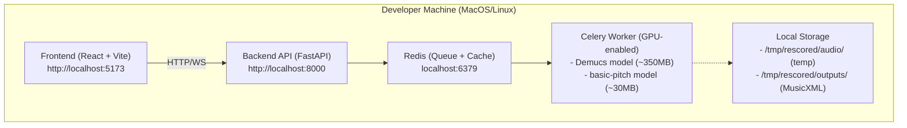
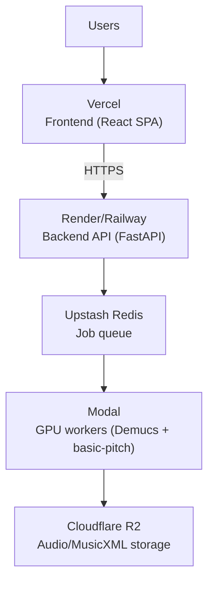
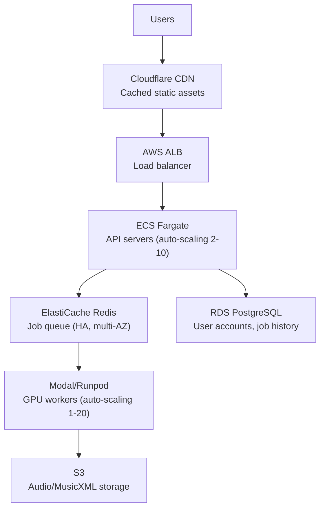

# Deployment Strategy

## Current Target: Local Development

The MVP focuses on getting the system working locally before worrying about production infrastructure.

### Local Development Architecture



### Setup Requirements

**Hardware**:
- **GPU**: NVIDIA GPU with 8GB+ VRAM (for Demucs)
  - Alternative: Run on CPU (10-20x slower, acceptable for development)
- **RAM**: 16GB+ recommended
- **Disk**: 10GB for models and temp files

**Software**:
- Docker Desktop (with GPU support) OR:
  - Python 3.11+
  - Node.js 18+
  - Redis 7+
  - CUDA Toolkit (if using GPU)

### Docker Compose Setup (Recommended)

```yaml
# docker-compose.yml
version: '3.8'

services:
  redis:
    image: redis:7-alpine
    ports:
      - "6379:6379"
    volumes:
      - redis_data:/data

  api:
    build: ./backend
    ports:
      - "8000:8000"
    environment:
      - REDIS_URL=redis://redis:6379
      - STORAGE_PATH=/app/storage
    volumes:
      - ./backend:/app
      - storage:/app/storage
    depends_on:
      - redis

  worker:
    build: ./backend
    command: celery -A tasks worker --loglevel=info
    environment:
      - REDIS_URL=redis://redis:6379
      - STORAGE_PATH=/app/storage
    volumes:
      - ./backend:/app
      - storage:/app/storage
    deploy:
      resources:
        reservations:
          devices:
            - driver: nvidia
              count: 1
              capabilities: [gpu]
    depends_on:
      - redis

  frontend:
    build: ./frontend
    ports:
      - "5173:5173"
    volumes:
      - ./frontend:/app
    environment:
      - VITE_API_URL=http://localhost:8000

volumes:
  redis_data:
  storage:
```

**Benefits**:
- One command to start everything: `docker-compose up`
- Consistent environment across developers
- GPU passthrough handled automatically
- Easy cleanup

**Limitations**:
- Slower hot reload than native
- GPU support requires Docker Desktop on Mac (experimental)

### Manual Setup (Alternative)

**Terminal 1 - Redis**:
```bash
redis-server
```

**Terminal 2 - Backend API**:
```bash
cd backend
uv venv
source .venv/bin/activate
uv pip install -r requirements.txt
uvicorn main:app --reload --port 8000
```

**Terminal 3 - Celery Worker**:
```bash
cd backend
source .venv/bin/activate
celery -A tasks worker --loglevel=info
```

**Terminal 4 - Frontend**:
```bash
cd frontend
npm install
npm run dev
```

**Benefits**:
- Faster hot reload
- Easier debugging
- More control

**Limitations**:
- Managing multiple terminals
- Environment inconsistency

---

## Future: Production Deployment

### Phase 2 - Proof of Concept Deployment

**Goal**: Share with friends, small beta test (< 100 users)

**Architecture**:


**Components**:

| Service | Provider | Why | Cost (est.) |
|---------|----------|-----|-------------|
| Frontend | Vercel | Free tier, great DX | $0 |
| Backend API | Render/Railway | Easy deploy, free tier | $0-7/month |
| Redis | Upstash | Serverless, free tier | $0 |
| GPU Workers | Modal | Pay-per-use GPU | $0.50/hour GPU time |
| Storage | Cloudflare R2 | Cheap, S3-compatible | $0.015/GB |

**Estimated Monthly Cost**: $10-50 for 100 users doing ~5 transcriptions/month
- 500 jobs/month × 2 min/job = 16 GPU hours/month = ~$8
- Storage: 100GB = ~$1.50
- Backend: Free tier (Render) or $7/month

**Deployment Flow**:
1. Push to `main` branch
2. Vercel auto-deploys frontend
3. Render auto-deploys API from Dockerfile
4. Modal workers pull latest image on invocation

**Limitations**:
- Cold starts (workers take 10-20s to start)
- No auto-scaling of API (single instance)
- Limited monitoring

---

### Phase 3 - Production Scale

**Goal**: Support 1000+ users, high availability

**Architecture**:


**Infrastructure**:

| Component | Service | Scaling | Cost |
|-----------|---------|---------|------|
| CDN | Cloudflare | Global edge caching | $20/month |
| API | ECS Fargate | 2-10 instances, CPU-based autoscaling | $50-200/month |
| Redis | ElastiCache | Multi-AZ, 2 nodes | $50/month |
| Workers | Modal | 1-20 GPU instances, queue-depth scaling | $500-2000/month |
| Storage | S3 | Lifecycle policies (delete after 30 days) | $50-100/month |
| DB | RDS PostgreSQL | Multi-AZ, auto-scaling storage | $50-100/month |
| Monitoring | Datadog/Sentry | Error tracking, metrics | $50/month |

**Estimated Monthly Cost**: $800-2500 for 10k transcriptions/month

**Features**:
- **Auto-scaling**: API scales on CPU, workers scale on queue depth
- **High availability**: Multi-AZ for DB and Redis
- **Monitoring**: Full observability (logs, metrics, traces)
- **Security**: VPC, encryption at rest, HTTPS everywhere
- **CI/CD**: GitHub Actions, blue-green deployments
- **Rate limiting**: Per-user quotas, IP-based throttling

**Deployment Pipeline**:
1. PR opened → GitHub Actions runs tests
2. Merge to `main` → Docker images built and pushed to ECR
3. ECS updates task definitions (rolling update)
4. Modal pulls new worker image on next invocation
5. Cloudflare cache invalidated for frontend assets

---

## GPU Infrastructure Deep Dive

### Local GPU (Development)

**Supported**:
- NVIDIA GPUs with CUDA 11.8+ support
- Apple Silicon (MPS backend) - experimental, slower

**Setup**:
```bash
# Check GPU
nvidia-smi

# Install PyTorch with CUDA
pip install torch torchvision torchaudio --index-url https://download.pytorch.org/whl/cu118
```

**Fallback to CPU**:
```python
# In worker code
device = "cuda" if torch.cuda.is_available() else "cpu"
```

**Processing Time**:
- GPU (RTX 3080): ~45 seconds per 3-minute song
- CPU (M1 Max): ~8 minutes per 3-minute song

---

### Serverless GPU (Production)

**Option 1: Modal** (Recommended)

**Pros**:
- Fast cold starts (10-20 seconds)
- Per-second billing
- No idle GPU cost
- Great Python support
- Volumes for model caching

**Cons**:
- Newer platform (less proven)
- US-only regions currently

**Example Worker**:
```python
import modal

stub = modal.Stub("rescored")

@stub.function(
    gpu="A10G",  # NVIDIA A10G (24GB VRAM)
    timeout=600,
    volumes={"/models": modal.Volume.from_name("model-cache")}
)
def process_audio(job_id: str, audio_url: str):
    # Demucs + basic-pitch processing
    pass
```

**Cost**: ~$0.60/hour for A10G GPU

---

**Option 2: RunPod Serverless**

**Pros**:
- Cheaper than Modal ($0.30-0.50/hour)
- More GPU options
- Global regions

**Cons**:
- Slower cold starts (30-60 seconds)
- More manual setup

---

**Option 3: AWS SageMaker/Lambda**

**Pros**:
- AWS ecosystem integration
- Well-documented

**Cons**:
- Expensive for small workloads
- Slow cold starts
- More complex setup

---

**Decision for Production**: Start with Modal, evaluate RunPod if cost becomes issue.

---

## Storage Strategy

### MVP (Local)
- Temp files: `/tmp/rescored/`
- Cleanup: Manual or cron job

### Production
- **Temp audio**: S3 with 1-day lifecycle policy (delete after processing)
- **Output files**: S3 Standard for 30 days, then delete OR:
  - S3 Intelligent-Tiering if keeping long-term
- **Model files**: Baked into Docker image or cached volume (Modal)

**S3 Bucket Structure**:
```
s3://rescored-prod/
  temp-audio/
    {job_id}.wav          # Delete after 1 day
  separated-stems/
    {job_id}/
      drums.wav
      bass.wav
      ...                 # Delete after 1 day
  outputs/
    {job_id}.musicxml     # Keep for 30 days
    {job_id}.midi         # Keep for 30 days
```

---

## Scaling Bottlenecks

### What Scales Easily
- Frontend (static assets, CDN)
- API servers (stateless, horizontal scaling)
- Redis (managed service auto-scaling)

### What Doesn't Scale Easily
- **GPU workers**: Expensive, limited availability
- **Source separation**: CPU/GPU bound, can't optimize much
- **Model loading**: Large models (350MB) slow cold starts

### Mitigation Strategies
1. **Pre-warm workers**: Keep 1-2 GPU workers hot during peak hours
2. **Model caching**: Use Modal volumes or Docker layers
3. **Queue prioritization**: Premium users get faster processing
4. **Job batching**: Process multiple songs on same GPU instance (future)
5. **Progressive results**: Return piano transcription first, other instruments later

---

## Cost Optimization

### Development
- Use CPU for small tests (slower but free)
- Limit worker parallelism to 1

### Production
- **Lifecycle policies**: Delete temp files after 1 day, outputs after 30 days
- **Reserved capacity**: If consistent load, reserve GPU instances (50% cheaper)
- **Spot instances**: Use for non-urgent jobs (70% cheaper, can be interrupted)
- **CDN caching**: Aggressive caching for static assets (frontend, model files)
- **Compression**: Gzip API responses, compress audio files before storage

---

## Monitoring & Observability

### Metrics to Track
- **API**: Request rate, latency, error rate
- **Workers**: Queue depth, processing time per stage, GPU utilization
- **Costs**: GPU hours used, storage size, API requests

### Logging
- **Structured logs**: JSON format with job_id, user_id, stage
- **Centralized**: CloudWatch, Datadog, or Loki

### Alerting
- Worker failures exceeding 5% of jobs
- Queue depth over 100 jobs (need more workers)
- GPU utilization below 50% (over-provisioned)
- API error rate over 1%

---

## Security Considerations

### Local Development
- No auth needed
- Redis on localhost only
- CORS enabled for `localhost:5173`

### Production
- **HTTPS only**: Enforce TLS for API and WebSocket
- **API authentication**: JWT tokens for user sessions
- **Rate limiting**: 10 jobs per user per hour
- **Input validation**: Check YouTube URL format, max video length
- **Secrets management**: Use environment variables or AWS Secrets Manager
- **VPC**: API and workers in private subnets
- **File scanning**: Check uploaded files for malware (if allowing file uploads)

---

## Disaster Recovery

### Backups
- **Redis**: Daily snapshots to S3
- **PostgreSQL**: Automated daily backups (RDS), 7-day retention
- **Code**: GitHub (already version controlled)
- **Models**: Re-downloadable, no backup needed

### Incident Response
- **Worker failure**: Job retried automatically (Celery)
- **API crash**: ECS restarts container, ALB routes to healthy instance
- **Redis failure**: ElastiCache auto-failover to standby
- **Complete outage**: Deploy from last known good commit, restore DB from backup

---

## Next Steps

1. Get local development working with Docker Compose
2. Test full pipeline end-to-end with sample YouTube videos
3. Deploy proof-of-concept to Vercel + Modal for beta testing
4. Collect metrics on processing time, costs, user feedback
5. Scale to production architecture if product gains traction

See [Audio Processing Pipeline](../backend/pipeline.md) for implementation details.
