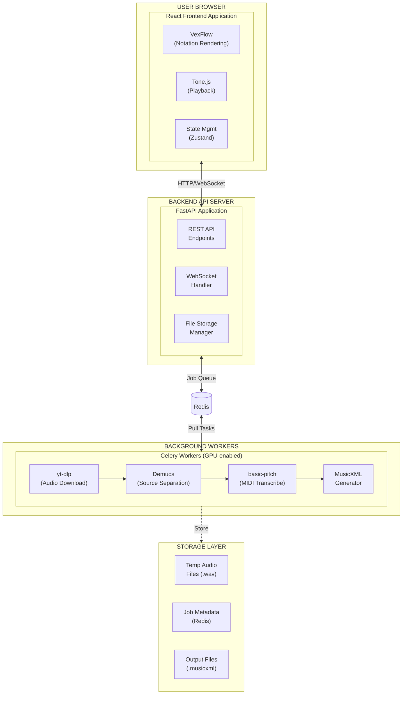
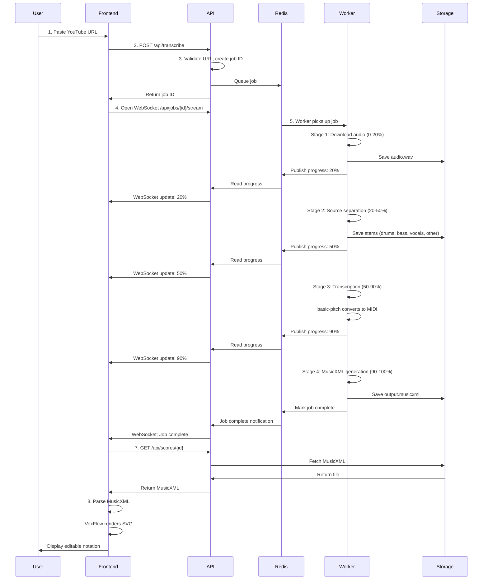
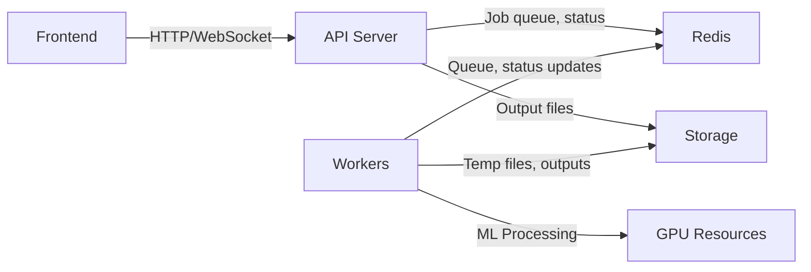

# System Architecture Overview

## High-Level Architecture

## Component Breakdown

### 1. Frontend Application (React)

**Responsibility**: User interface for submitting URLs, viewing/editing notation, and playback

**Key Libraries**:
- **VexFlow**: Renders music notation as interactive SVG
- **Tone.js**: Browser-based MIDI playback and synthesis
- **React**: UI framework with state management

**Data Flow**:
- User submits YouTube URL
- Receives job ID, polls/streams progress via WebSocket
- Fetches MusicXML result when complete
- Renders notation, enables editing
- Exports to PDF/MIDI/MusicXML

### 2. Backend API Server (FastAPI)

**Responsibility**: HTTP API, WebSocket connections, job orchestration

**Endpoints**:
- `POST /api/transcribe` - Submit URL, queue processing job
- `GET /api/jobs/{id}` - Get job status
- `WS /api/jobs/{id}/stream` - Real-time progress updates
- `GET /api/scores/{id}` - Download MusicXML
- `GET /api/scores/{id}/midi` - Download MIDI

**Key Functions**:
- YouTube URL validation
- Job creation and status tracking
- WebSocket broadcast to connected clients
- File serving (MusicXML, MIDI, PDF)

### 3. Background Workers (Celery)

**Responsibility**: Heavy audio/ML processing asynchronously

**Processing Pipeline**:
1. **Download** (`yt-dlp`): Extract audio from YouTube
2. **Separate** (`Demucs`): Split into instrument stems (drums, bass, vocals, other)
3. **Transcribe** (`basic-pitch`): Convert audio → MIDI notes per stem
4. **Generate** (music21/custom): MIDI → MusicXML with metadata

**Worker Configuration**:
- GPU access required for Demucs and basic-pitch
- Task timeout: 10 minutes per job
- Retry logic for transient failures
- Progress updates sent to Redis, broadcasted via WebSocket

### 4. Storage Layer

**Temporary Storage** (Local filesystem or S3):
- Downloaded audio files (.m4a, .wav)
- Separated stems (.wav per instrument)
- Intermediate MIDI files

**Persistent Storage** (Redis):
- Job queue and status
- Progress percentage and current stage
- Error messages and logs

**Output Storage** (Filesystem/S3):
- Generated MusicXML files
- MIDI exports
- PDF renders (future)

## Data Flow: URL → Notation

### Step-by-Step User Flow

## Technology Stack Summary

| Layer | Technology | Why? |
|-------|-----------|------|
| Frontend Framework | React | Component-based UI, large ecosystem |
| Notation Rendering | VexFlow | Best browser-based music engraving library |
| Audio Playback | Tone.js | WebAudio wrapper with scheduling and synthesis |
| Backend Framework | FastAPI | Async Python, auto-generated API docs, WebSocket support |
| Task Queue | Celery + Redis | Industry standard for async Python jobs |
| Source Separation | Demucs | State-of-the-art audio separation (Meta Research) |
| Transcription | basic-pitch | Spotify's open-source polyphonic transcription |
| Music Notation Format | MusicXML | Universal interchange format for notation software |

See [Technology Stack](tech-stack.md) for detailed trade-off analysis.

## Key Architectural Decisions

### Why Async Processing?

Audio processing is slow (1-2 minutes for a 3-minute song):
- Demucs source separation: ~30-60 seconds (GPU)
- basic-pitch transcription: ~15-30 seconds per stem
- Total: 1-2 minutes minimum

Blocking HTTP requests for 2 minutes is unacceptable UX. Solution:
- Job queue decouples API from processing
- WebSocket provides real-time updates without polling overhead
- Users can close tab and return later

### Why Server-Side Processing?

ML models are too large for browsers:
- Demucs model: ~350MB
- basic-pitch model: ~30MB
- GPU acceleration critical for performance
- User devices lack compute power for real-time processing

### Why MusicXML Over MIDI?

MIDI is great for playback but lacks notation-specific metadata:
- No staff layout, clef, or articulation marks
- No measure boundaries or bar lines
- No lyrics or dynamics

MusicXML is the standard for music notation interchange:
- Used by Finale, Sibelius, MuseScore, Dorico
- Supports full notation semantics
- Can be converted to MIDI for playback

### Why VexFlow Over Alternatives?

**VexFlow** (chosen):
- Pure JavaScript, no dependencies
- Excellent rendering quality
- Programmatic SVG generation (good for editing)
- Active maintenance

**OpenSheetMusicDisplay** (alternative):
- More complete MusicXML support
- Less control over rendering
- Harder to build interactive editing on top

## Scaling Considerations

### MVP (Local Development)
- Single machine with GPU
- Processes one job at a time
- Redis on localhost
- Temp storage on local disk

### Production (Future)
- **Frontend**: Static hosting (Vercel, Netlify, S3+CloudFront)
- **API**: Containerized FastAPI (AWS ECS, GCP Cloud Run)
- **Workers**: Serverless GPU (Modal, RunPod) or K8s with GPU nodes
- **Storage**: S3 for audio/outputs, Redis Cloud for queue
- **Scaling**: Horizontal scaling of workers based on queue depth

See [Deployment Strategy](deployment.md) for details.

## Dependencies Between Components

**Critical Path**: Workers depend on GPU availability. If GPU is busy, jobs queue up.

## Security Considerations

- **YouTube URL validation**: Prevent SSRF attacks, validate domain
- **Rate limiting**: Prevent abuse (max 10 jobs per IP per hour)
- **Job isolation**: Sandboxed worker processes
- **Temp file cleanup**: Delete audio files after processing
- **Copyright**: User-generated content, platform not liable (DMCA safe harbor)

## Error Handling Strategy

- **Retryable errors**: Network failures, temporary YouTube blocks → retry 3x
- **Permanent errors**: Invalid URL, age-restricted video, copyright block → fail immediately
- **Partial failures**: Some stems fail transcription → return partial results
- **Timeout**: Jobs exceeding 10 minutes killed, status marked failed

## Monitoring & Observability (Future)

- **Metrics**: Job success rate, processing time per stage, queue depth
- **Logging**: Structured logs per job ID
- **Tracing**: End-to-end latency from URL submit to MusicXML ready
- **Alerts**: Worker failures, high queue depth, high error rate

## Next Steps

1. Read [Technology Stack](tech-stack.md) for detailed tech analysis
2. Review [Audio Processing Pipeline](../backend/pipeline.md) for implementation details
3. See [MVP Scope](../features/mvp.md) for what to build first
