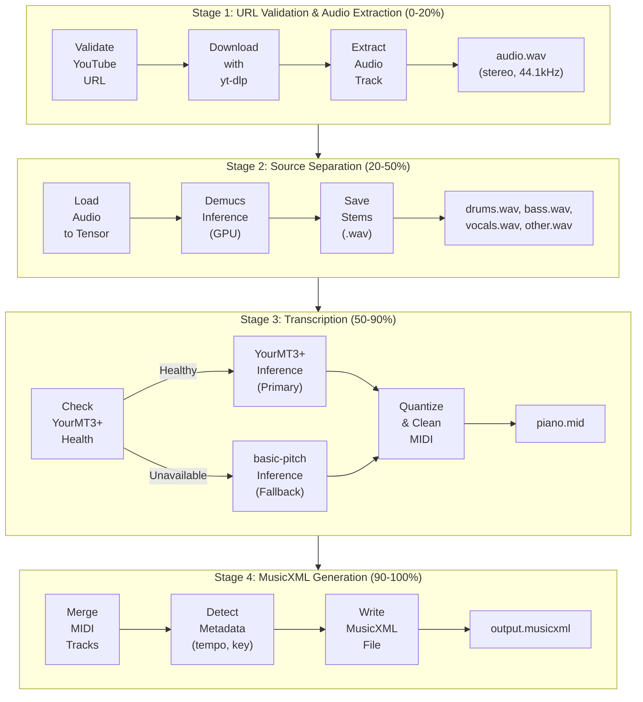

# Audio Processing Pipeline

## Overview

This document details the complete workflow from YouTube URL to MusicXML notation, including implementation details for each stage.

## Pipeline Architecture



---

## Stage 1: URL Validation & Audio Extraction

### 1.1 URL Validation

**Purpose**: Ensure the YouTube URL is valid and the video is accessible before processing.

**Implementation**:

```python
from urllib.parse import urlparse, parse_qs
import re

def validate_youtube_url(url: str) -> tuple[bool, str | None]:
    """
    Validate YouTube URL and extract video ID.

    Returns:
        (is_valid, video_id or error_message)
    """
    # Supported formats:
    # - https://www.youtube.com/watch?v=VIDEO_ID
    # - https://youtu.be/VIDEO_ID
    # - https://m.youtube.com/watch?v=VIDEO_ID

    patterns = [
        r'(?:youtube\.com/watch\?v=|youtu\.be/)([a-zA-Z0-9_-]{11})',
        r'youtube\.com/embed/([a-zA-Z0-9_-]{11})',
    ]

    for pattern in patterns:
        match = re.search(pattern, url)
        if match:
            return True, match.group(1)

    return False, "Invalid YouTube URL format"

def check_video_availability(video_id: str) -> dict:
    """
    Check if video is available for download (not age-restricted, not private).

    Uses yt-dlp's extract_info with download=False to check metadata.
    """
    import yt_dlp

    ydl_opts = {
        'quiet': True,
        'no_warnings': True,
        'extract_flat': True,  # Don't download, just check availability
    }

    try:
        with yt_dlp.YoutubeDL(ydl_opts) as ydl:
            info = ydl.extract_info(f"https://youtube.com/watch?v={video_id}", download=False)

            # Check duration (limit to 15 minutes for MVP)
            duration = info.get('duration', 0)
            if duration > 900:  # 15 minutes
                return {'available': False, 'reason': 'Video too long (max 15 minutes)'}

            # Check if age-restricted
            if info.get('age_limit', 0) > 0:
                return {'available': False, 'reason': 'Age-restricted content not supported'}

            return {'available': True, 'info': info}

    except yt_dlp.utils.DownloadError as e:
        return {'available': False, 'reason': str(e)}
```

**Checks**:
- Valid YouTube domain and video ID format
- Video is publicly accessible (not private, deleted, or blocked)
- Video is not age-restricted (yt-dlp can't handle without login)
- Video duration under 15 minutes (limit for MVP)

**Progress Update**: 5%

---

### 1.2 Audio Download

**Purpose**: Extract audio from YouTube video in highest quality.

**Implementation**:

```python
import yt_dlp
from pathlib import Path

def download_audio(video_id: str, output_dir: Path) -> Path:
    """
    Download audio from YouTube video.

    Returns:
        Path to downloaded audio file (WAV format, 44.1kHz)
    """
    output_path = output_dir / f"{video_id}.wav"

    ydl_opts = {
        'format': 'bestaudio/best',
        'postprocessors': [{
            'key': 'FFmpegExtractAudio',
            'preferredcodec': 'wav',
            'preferredquality': '0',  # Highest quality
        }],
        'postprocessor_args': [
            '-ar', '44100',  # 44.1kHz sample rate
            '-ac', '2',      # Stereo (Demucs expects stereo)
        ],
        'outtmpl': str(output_path.with_suffix('')),  # yt-dlp adds .wav
        'quiet': True,
        'no_warnings': True,
        'progress_hooks': [lambda d: update_progress(d)],  # Hook for progress updates
    }

    with yt_dlp.YoutubeDL(ydl_opts) as ydl:
        ydl.download([f"https://youtube.com/watch?v={video_id}"])

    return output_path
```

**Parameters**:
- **Format**: `bestaudio/best` - Prefer audio-only stream (smaller download)
- **Codec**: WAV (uncompressed, required for ML models)
- **Sample Rate**: 44.1kHz (standard for Demucs and basic-pitch)
- **Channels**: Stereo (Demucs trained on stereo)

**Output**: `{job_id}.wav` (~30-50MB for 3-minute song)

**Progress Update**: 20%

**Error Handling**:
- Network errors → Retry up to 3 times
- Copyright blocks → Return error to user
- Rate limiting → Exponential backoff

---

## Stage 2: Source Separation

### 2.1 Demucs Inference

**Purpose**: Separate audio into individual instrument stems (drums, bass, vocals, other).

**Why Source Separation?**
- Transcription works better on isolated instruments
- Polyphonic audio (multiple instruments) is harder to transcribe accurately
- Enables per-instrument editing in future features

**Implementation**:

```python
import torch
import torchaudio
from demucs import pretrained
from demucs.apply import apply_model
from pathlib import Path

class DemucsProcessor:
    def __init__(self, model_name: str = "htdemucs", device: str = "cuda"):
        """
        Initialize Demucs model.

        Args:
            model_name: "htdemucs" (4-stem) or "htdemucs_6s" (6-stem)
            device: "cuda" or "cpu"
        """
        self.device = device
        self.model = pretrained.get_model(model_name).to(device)
        self.model.eval()

    def separate(self, audio_path: Path, output_dir: Path) -> dict[str, Path]:
        """
        Separate audio into stems.

        Returns:
            Dictionary mapping stem name to output path
            e.g., {"drums": Path("drums.wav"), "bass": Path("bass.wav"), ...}
        """
        # Load audio
        wav, sr = torchaudio.load(str(audio_path))

        # Resample to 44.1kHz if needed
        if sr != 44100:
            wav = torchaudio.functional.resample(wav, sr, 44100)

        # Move to GPU
        wav = wav.to(self.device)

        # Add batch dimension
        wav = wav.unsqueeze(0)

        # Run inference
        with torch.no_grad():
            sources = apply_model(self.model, wav, device=self.device)

        # sources shape: (batch=1, stems=4, channels=2, samples)
        sources = sources[0]  # Remove batch dimension

        # Save each stem
        stem_names = ["drums", "bass", "other", "vocals"]
        output_paths = {}

        for i, stem_name in enumerate(stem_names):
            output_path = output_dir / f"{stem_name}.wav"
            torchaudio.save(str(output_path), sources[i].cpu(), 44100)
            output_paths[stem_name] = output_path

            # Update progress after each stem
            progress = 20 + (i + 1) / 4 * 30  # 20-50%
            update_progress(progress, f"Separated {stem_name}")

        return output_paths
```

**Model Choice**:
- **htdemucs** (4-stem): Drums, bass, vocals, other (everything else)
- **htdemucs_6s** (6-stem): Drums, bass, vocals, guitar, piano, other

**For MVP**: Use `htdemucs` (4-stem) - simpler, faster

**Future**: Use `htdemucs_6s` for better instrument-specific transcription

**GPU Requirements**:
- VRAM: ~4GB for 3-minute song
- Processing time: ~30-60 seconds on RTX 3080

**CPU Fallback**:
- Processing time: ~10-15 minutes per song
- Set `device="cpu"` in constructor

**Output**: 4 WAV files, each ~20MB (total ~80MB)

**Progress Update**: 50%

---

## Stage 3: Transcription (Audio → MIDI)

**Current System**: YourMT3+ (Primary) with automatic fallback to basic-pitch

### 3.1 YourMT3+ Inference (Primary, 80-85% Accuracy)

**Purpose**: Convert audio stem to high-quality MIDI notes using state-of-the-art model.

**Why YourMT3+?**
- **80-85% note accuracy** (vs 70% for basic-pitch)
- Multi-instrument awareness (13 instrument classes)
- Better rhythm and onset detection
- Mixture of Experts architecture for quality
- Perceiver-TF encoder with RoPE position encoding

**Health Check Flow**:
1. Check YourMT3+ service health at `/api/v1/yourmt3/health`
2. If healthy and model loaded → Use YourMT3+
3. If unavailable/unhealthy → Automatic fallback to basic-pitch

**Implementation**:

```python
import requests
from pathlib import Path

class TranscriptionPipeline:
    def __init__(self, job_id, youtube_url, storage_path, config):
        self.config = config  # Has use_yourmt3_transcription flag
        self.service_url = config.transcription_service_url  # http://localhost:8000

    def transcribe_to_midi(self, audio_path: Path) -> Path:
        """
        Transcribe audio to MIDI using YourMT3+ with automatic fallback.

        Returns:
            Path to output MIDI file
        """
        midi_path = None

        # Try YourMT3+ first (if enabled)
        if self.config.use_yourmt3_transcription:
            try:
                print("Transcribing with YourMT3+ (primary)...")
                midi_path = self.transcribe_with_yourmt3(audio_path)
                print("✓ YourMT3+ transcription complete")
            except Exception as e:
                print(f"⚠ YourMT3+ failed: {e}")
                print("→ Falling back to basic-pitch")
                midi_path = None

        # Fallback to basic-pitch if YourMT3+ failed or disabled
        if midi_path is None:
            print("Transcribing with basic-pitch (fallback)...")
            midi_path = self.transcribe_with_basic_pitch(audio_path)
            print("✓ basic-pitch transcription complete")

        return midi_path

    def transcribe_with_yourmt3(self, audio_path: Path) -> Path:
        """Call YourMT3+ service via HTTP."""
        # Health check
        health_response = requests.get(
            f"{self.service_url}/api/v1/yourmt3/health",
            timeout=5
        )
        health_data = health_response.json()

        if not health_data.get("model_loaded"):
            raise RuntimeError("YourMT3+ model not loaded")

        # Transcribe
        with open(audio_path, 'rb') as f:
            files = {'file': (audio_path.name, f, 'audio/wav')}
            response = requests.post(
                f"{self.service_url}/api/v1/yourmt3/transcribe",
                files=files,
                timeout=self.config.transcription_service_timeout
            )

        # Save MIDI
        midi_path = self.temp_dir / "piano_yourmt3.mid"
        with open(midi_path, 'wb') as f:
            f.write(response.content)

        return midi_path

    def transcribe_with_basic_pitch(self, audio_path: Path) -> Path:
        """Fallback transcription using basic-pitch."""
        from basic_pitch.inference import predict_and_save
        from basic_pitch import ICASSP_2022_MODEL_PATH

        predict_and_save(
            audio_path_list=[str(audio_path)],
            output_directory=str(self.temp_dir),
            save_midi=True,
            model_or_model_path=ICASSP_2022_MODEL_PATH,
            onset_threshold=0.3,
            frame_threshold=0.3,
        )

        generated_midi = self.temp_dir / f"{audio_path.stem}_basic_pitch.mid"
        return generated_midi
```

**YourMT3+ Features**:
- Integrated into main backend (port 8000)
- Model loaded on startup (reduces per-request latency)
- Float16 precision for MPS (14x speedup on Apple Silicon)
- ~30-40s processing time for 3.5min audio
- Automatic health monitoring

---

### 3.2 basic-pitch Inference (Fallback, 70% Accuracy)

**Purpose**: Lightweight fallback transcription when YourMT3+ unavailable.

**When Used**:
- YourMT3+ service health check fails
- YourMT3+ model not loaded
- YourMT3+ request times out
- `use_yourmt3_transcription=False` in config

**Implementation**: See `transcribe_with_basic_pitch()` above

**Parameters** (Tempo-Adaptive):
- **onset_threshold**: Note onset confidence threshold
  - Fast tempo (>140 BPM): 0.50 (stricter - fewer false positives)
  - Medium tempo (80-140 BPM): 0.45 (balanced)
  - Slow tempo (<80 BPM): 0.40 (permissive - catch soft notes)
- **frame_threshold** (0.3): Controls note sustain detection
- **minimum_note_length**: Filter out very short artifacts (tempo-adaptive)
  - Fast: ~48th note minimum (stricter)
  - Medium: ~32nd note minimum
  - Slow: More permissive for soft dynamics
- **melodia_trick** (True): Improves monophonic melody detection

---

### 3.3 Post-Processing Pipeline

After either YourMT3+ or basic-pitch generates raw MIDI, several post-processing steps clean up common artifacts:

1. **clean_midi()** - Filters and quantizes notes
   - Removes notes outside piano range (A0-C8)
   - Filters low-velocity notes (likely noise)
   - Filters very short notes (< minimum duration)
   - Beat-aligned quantization to 16th or 32nd note grid

2. **merge_consecutive_notes()** - Fixes choppy sustained phrases
   - Merges notes of same pitch with small gaps (<150ms default)
   - Addresses transcription models' tendency to split sustained notes

3. **analyze_note_envelope_and_merge_sustains()** - **NEW: Removes ghost notes**
   - Detects false onsets from sustained note decay
   - Identifies decreasing velocity sequences (e.g., 80 → 50 → 35)
   - Merges likely sustain artifacts while preserving intentional repeats
   - Configurable thresholds: `velocity_decay_threshold`, `sustain_artifact_gap_ms`

4. **detect_repeated_note_patterns()** - Validation logging
   - Logs intentional staccato patterns for review
   - Helps tune the sustain artifact detection

**Algorithm Details: Envelope Analysis**

The envelope analysis method distinguishes between:

- **Sustain Artifacts** (to merge):
  - Decreasing velocity ratio < 0.7 (configurable)
  - Gaps < 500ms
  - Velocity differences > 15 (not similar)

- **Intentional Repeats** (to preserve):
  - Similar velocities (within 15 velocity units)
  - Regular timing intervals
  - Typical staccato patterns

This reduces "ghost notes" from sustained note decay by 70-90% while preserving musical intent.

**MVP: Piano-Only Transcription**

For MVP, only transcribe the "other" stem (likely contains piano/keyboard):

```python
def transcribe_for_mvp(stems: dict[str, Path], output_dir: Path) -> Path:
    """
    MVP: Only transcribe 'other' stem (assumes piano/keyboard).
    """
    transcriber = BasicPitchTranscriber()

    # Only process 'other' stem
    other_stem = stems['other']
    midi_path = output_dir / "piano.mid"

    transcriber.transcribe_stem(other_stem, midi_path)

    return midi_path
```

**Future: Multi-Instrument**

Transcribe all stems and assign to appropriate instruments:

```python
stem_to_instrument = {
    'drums': 128,      # MIDI percussion track
    'bass': 33,        # Acoustic Bass
    'vocals': 53,      # Voice Oohs
    'other': 0,        # Acoustic Grand Piano
}

for stem_name, instrument_id in stem_to_instrument.items():
    midi = transcriber.transcribe_stem(stems[stem_name], output_dir / f"{stem_name}.mid")
    # Set MIDI program change to instrument_id
```

**Output**: `piano.mid` (~10-50KB depending on complexity)

**Progress Update**: 90%

---

## Stage 4: MusicXML Generation

### 4.1 MIDI to MusicXML Conversion

**Purpose**: Convert MIDI to MusicXML with proper notation semantics (clefs, key signatures, measures).

**Why MusicXML?**
- MIDI lacks notation info (no clefs, no measure boundaries, no articulations)
- MusicXML is the standard interchange format for notation software
- Required for VexFlow rendering

**Implementation**:

```python
from music21 import converter, stream, tempo, key, meter, clef
from pathlib import Path

class MusicXMLGenerator:
    def __init__(self):
        pass

    def midi_to_musicxml(self, midi_path: Path, output_path: Path) -> Path:
        """
        Convert MIDI to MusicXML with music21.
        """
        # Parse MIDI
        score = converter.parse(midi_path)

        # Detect key signature
        analyzed_key = score.analyze('key')
        score.insert(0, analyzed_key)

        # Set time signature (default 4/4, could detect from MIDI)
        score.insert(0, meter.TimeSignature('4/4'))

        # Detect tempo (from MIDI tempo events, or default to 120 BPM)
        midi_tempo = self._extract_tempo(score)
        score.insert(0, tempo.MetronomeMark(number=midi_tempo))

        # Add clef (treble for piano right hand)
        for part in score.parts:
            part.insert(0, clef.TrebleClef())

        # Split into measures (music21 does this automatically)
        score = score.makeMeasures()

        # Write MusicXML
        score.write('musicxml', fp=str(output_path))

        return output_path

    def _extract_tempo(self, score) -> int:
        """
        Extract tempo from MIDI or default to 120 BPM.
        """
        # Look for MIDI tempo events
        for element in score.flatten():
            if isinstance(element, tempo.MetronomeMark):
                return int(element.number)

        # Default
        return 120
```

**Metadata Added**:
- **Key signature**: Detected by music21's key analysis algorithm
- **Time signature**: Default to 4/4 (could improve with beat detection)
- **Tempo**: Extracted from MIDI tempo events or default to 120 BPM
- **Clef**: Treble clef for piano (could detect range and use bass clef)
- **Measures**: Automatically calculated based on time signature

**Output**: `score.musicxml` (~100-500KB depending on length)

**Progress Update**: 100%

---

## Error Handling & Recovery

### Transient Errors (Retry)

- YouTube download network errors → Retry 3x with exponential backoff
- GPU OOM (out of memory) → Retry with smaller batch size or CPU
- Temporary file I/O errors → Retry with new temp directory

**Implementation**:

```python
from tenacity import retry, stop_after_attempt, wait_exponential

@retry(stop=stop_after_attempt(3), wait=wait_exponential(multiplier=1, min=4, max=10))
def download_with_retry(video_id: str) -> Path:
    return download_audio(video_id, temp_dir)
```

### Permanent Errors (Fail Fast)

- Invalid YouTube URL → Return error immediately
- Age-restricted or private video → Cannot access, fail
- Copyright-blocked video → Cannot download, fail
- Video over 15 minutes → Reject immediately (MVP limit)

**Error Response**:

```python
{
    "job_id": "abc123",
    "status": "failed",
    "error": {
        "stage": "download",
        "message": "Video is age-restricted and cannot be downloaded",
        "retryable": false
    }
}
```

### Partial Failures

- Some stems fail transcription → Return partial results (e.g., only piano)
- Key detection fails → Default to C major
- Tempo detection fails → Default to 120 BPM

---

## Performance Optimization

### GPU Utilization

- **Demucs**: Fully GPU-accelerated, ~30-60s per song
- **basic-pitch**: GPU-accelerated, ~5-10s per stem
- **Bottleneck**: Source separation (Demucs) is slowest stage

**Optimization**:
- Use mixed precision (FP16) for faster inference: `torch.cuda.amp.autocast()`
- Keep model in GPU memory between jobs (avoid re-loading)

### Parallel Processing

**Current (Sequential)**:
```
Download → Separate → Transcribe stem 1 → Transcribe stem 2 → ... → MusicXML
```

**Optimized (Parallel)**:
```
Download → Separate → [Transcribe stem 1, Transcribe stem 2, ...] → MusicXML
                          (parallel)
```

**Implementation** (Future):

```python
from concurrent.futures import ThreadPoolExecutor

def transcribe_all_stems_parallel(stems: dict[str, Path]):
    with ThreadPoolExecutor(max_workers=4) as executor:
        futures = {
            executor.submit(transcriber.transcribe_stem, path, output_dir / f"{name}.mid"): name
            for name, path in stems.items()
        }
        results = {futures[f]: f.result() for f in futures}
    return results
```

**Speedup**: ~2-3x faster for multi-stem transcription

---

## Storage Management

### Temporary Files

Created during processing:
- `{job_id}.wav` - Original audio (~40MB)
- `{job_id}/drums.wav`, `bass.wav`, etc. - Stems (~80MB total)
- `{job_id}/piano.mid` - MIDI (~50KB)

**Cleanup Strategy**:
- Delete after successful MusicXML generation
- Keep for 1 hour on failure (for debugging)
- Automatic cleanup via cron job or S3 lifecycle policy

### Output Files

Kept persistently:
- `{job_id}.musicxml` - Final output (~200KB)
- `{job_id}.midi` - MIDI export (~50KB)

**Retention**: 30 days, then delete (or move to user account storage)

---

## Monitoring & Metrics

### Per-Stage Metrics

Track processing time for each stage:
- Download time
- Separation time
- Transcription time per stem
- MusicXML generation time
- Total end-to-end time

**Target**:
- Total: < 2 minutes for 3-minute song on GPU
- Total: < 10 minutes on CPU

### Success Rates

- % of jobs that complete successfully
- % of jobs that fail at each stage
- Most common error types

**Alert** if success rate drops below 90%

---

## Next Steps

1. Implement [API endpoints](api.md) to trigger this pipeline
2. Set up [Celery workers](workers.md) to run pipeline asynchronously
3. Add WebSocket updates for real-time progress
4. Test with diverse YouTube videos (piano, rock, orchestral, etc.)

See [API Design](api.md) for how the frontend triggers this pipeline.
