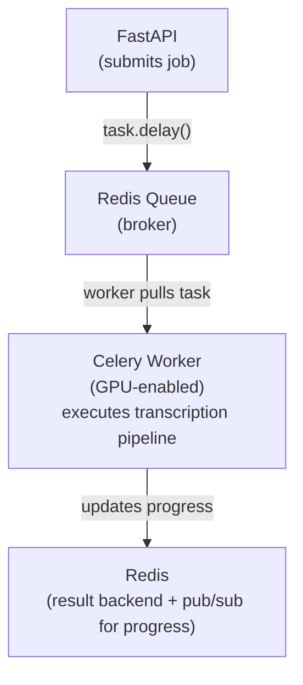

# Background Job Processing with Celery

## Overview

Celery workers handle the heavy audio processing asynchronously, allowing the API to respond immediately while transcription happens in the background.

## Why Celery?

- **Async Processing**: Transcription takes 1-2 minutes—can't block HTTP requests
- **Retry Logic**: Automatic retries for transient failures
- **Priority Queues**: Urgent jobs (premium users) get processed first
- **Distributed**: Scale workers horizontally across machines
- **Monitoring**: Built-in tools (Flower) for observability

## Architecture



## Celery Configuration

### celery_app.py

```python
from celery import Celery
from kombu import Exchange, Queue

# Initialize Celery
celery_app = Celery(
    "rescored",
    broker="redis://localhost:6379/0",
    backend="redis://localhost:6379/0",
)

# Configuration
celery_app.conf.update(
    task_serializer="json",
    accept_content=["json"],
    result_serializer="json",
    timezone="UTC",
    enable_utc=True,

    # Task settings
    task_track_started=True,
    task_time_limit=600,  # 10 minutes max per task
    task_soft_time_limit=540,  # Soft limit at 9 minutes
    task_acks_late=True,  # Acknowledge task after completion (safer)
    worker_prefetch_multiplier=1,  # Take 1 task at a time (better for long tasks)

    # Retry settings
    task_autoretry_for=(Exception,),
    task_retry_kwargs={'max_retries': 3},
    task_retry_backoff=True,  # Exponential backoff: 1s, 2s, 4s
    task_retry_backoff_max=600,

    # Priority queues
    task_queues=(
        Queue('default', Exchange('default'), routing_key='default', priority=5),
        Queue('high_priority', Exchange('high_priority'), routing_key='high_priority', priority=10),
    ),
    task_default_queue='default',
    task_default_routing_key='default',
)
```

## Main Worker Task

### tasks.py

```python
from celery import Task
from celery_app import celery_app
from pipeline import AudioPipeline
import redis
import json
from datetime import datetime

redis_client = redis.Redis(host='localhost', port=6379, decode_responses=True)

class TranscriptionTask(Task):
    """Base task with progress tracking."""

    def update_progress(self, job_id: str, progress: int, stage: str, message: str):
        """Update job progress in Redis and publish to WebSocket subscribers."""
        job_key = f"job:{job_id}"

        # Update Redis hash
        redis_client.hset(job_key, mapping={
            "progress": progress,
            "current_stage": stage,
            "status_message": message,
            "updated_at": datetime.utcnow().isoformat(),
        })

        # Publish to pub/sub for WebSocket clients
        update = {
            "type": "progress",
            "job_id": job_id,
            "progress": progress,
            "stage": stage,
            "message": message,
            "timestamp": datetime.utcnow().isoformat(),
        }
        redis_client.publish(f"job:{job_id}:updates", json.dumps(update))

@celery_app.task(base=TranscriptionTask, bind=True)
def process_transcription_task(self, job_id: str):
    """
    Main transcription task.

    Args:
        job_id: Unique job identifier

    Returns:
        Path to generated MusicXML file
    """
    try:
        # Mark job as started
        redis_client.hset(f"job:{job_id}", mapping={
            "status": "processing",
            "started_at": datetime.utcnow().isoformat(),
        })

        # Get job data
        job_data = redis_client.hgetall(f"job:{job_id}")
        video_id = job_data['video_id']

        # Initialize pipeline
        pipeline = AudioPipeline(
            job_id=job_id,
            progress_callback=lambda p, s, m: self.update_progress(job_id, p, s, m)
        )

        # Run pipeline
        output_path = pipeline.process(video_id)

        # Mark job as completed
        redis_client.hset(f"job:{job_id}", mapping={
            "status": "completed",
            "progress": 100,
            "output_path": str(output_path),
            "completed_at": datetime.utcnow().isoformat(),
        })

        # Publish completion message
        completion_msg = {
            "type": "completed",
            "job_id": job_id,
            "result_url": f"/api/v1/scores/{job_id}",
            "timestamp": datetime.utcnow().isoformat(),
        }
        redis_client.publish(f"job:{job_id}:updates", json.dumps(completion_msg))

        return str(output_path)

    except Exception as e:
        # Mark job as failed
        redis_client.hset(f"job:{job_id}", mapping={
            "status": "failed",
            "error": json.dumps({
                "message": str(e),
                "retryable": self.request.retries < self.max_retries,
            }),
            "failed_at": datetime.utcnow().isoformat(),
        })

        # Publish error message
        error_msg = {
            "type": "error",
            "job_id": job_id,
            "error": {
                "message": str(e),
                "retryable": self.request.retries < self.max_retries,
            },
            "timestamp": datetime.utcnow().isoformat(),
        }
        redis_client.publish(f"job:{job_id}:updates", json.dumps(error_msg))

        # Retry if retryable
        if self.request.retries < self.max_retries:
            raise self.retry(exc=e, countdown=2 ** self.request.retries)
        else:
            raise
```

## Pipeline Implementation

### pipeline.py

```python
from pathlib import Path
from typing import Callable
import tempfile
import shutil

class AudioPipeline:
    """Orchestrates the full transcription pipeline."""

    def __init__(self, job_id: str, progress_callback: Callable):
        self.job_id = job_id
        self.progress = progress_callback
        self.temp_dir = Path(tempfile.mkdtemp(prefix=f"rescored_{job_id}_"))

    def process(self, video_id: str) -> Path:
        """
        Run full pipeline: download → separate → transcribe → MusicXML

        Returns:
            Path to generated MusicXML file
        """
        try:
            # Stage 1: Download
            self.progress(5, "download", "Validating YouTube URL")
            audio_path = self.download_audio(video_id)

            # Stage 2: Source Separation
            self.progress(20, "separation", "Starting source separation")
            stems = self.separate_stems(audio_path)

            # Stage 3: Transcription
            self.progress(50, "transcription", "Transcribing audio to MIDI")
            midi_path = self.transcribe_stems(stems)

            # Stage 4: MusicXML
            self.progress(90, "musicxml", "Generating MusicXML")
            output_path = self.generate_musicxml(midi_path)

            self.progress(100, "musicxml", "Transcription complete")

            return output_path

        finally:
            # Cleanup temp files
            self.cleanup()

    def download_audio(self, video_id: str) -> Path:
        # Implementation from pipeline.md
        pass

    def separate_stems(self, audio_path: Path) -> dict:
        # Implementation from pipeline.md
        pass

    def transcribe_stems(self, stems: dict) -> Path:
        # Implementation from pipeline.md (MVP: only 'other' stem)
        pass

    def generate_musicxml(self, midi_path: Path) -> Path:
        # Implementation from pipeline.md
        pass

    def cleanup(self):
        """Delete temporary files."""
        if self.temp_dir.exists():
            shutil.rmtree(self.temp_dir)
```

## Worker Startup

### Starting Workers Locally

```bash
# Start single worker (development)
celery -A tasks worker --loglevel=info

# Start worker with GPU support
celery -A tasks worker --loglevel=info --concurrency=1

# Start with autoscaling (2-10 workers based on queue depth)
celery -A tasks worker --autoscale=10,2
```

### Starting Workers in Production (Docker)

```dockerfile
# Dockerfile.worker
FROM nvidia/cuda:11.8.0-runtime-ubuntu22.04

RUN apt-get update && apt-get install -y python3.11 python3-pip ffmpeg

WORKDIR /app
COPY requirements.txt .
RUN pip install -r requirements.txt

COPY . .

CMD ["celery", "-A", "tasks", "worker", "--loglevel=info", "--concurrency=1"]
```

```yaml
# docker-compose.yml
worker:
  build:
    context: ./backend
    dockerfile: Dockerfile.worker
  command: celery -A tasks worker --loglevel=info --concurrency=1
  environment:
    - CELERY_BROKER_URL=redis://redis:6379/0
    - CELERY_RESULT_BACKEND=redis://redis:6379/0
  deploy:
    resources:
      reservations:
        devices:
          - driver: nvidia
            count: 1
            capabilities: [gpu]
```

## Priority Queues

### Assigning Jobs to Queues

```python
# High priority (premium users, future)
process_transcription_task.apply_async(
    args=[job_id],
    queue='high_priority'
)

# Normal priority
process_transcription_task.delay(job_id)  # Uses default queue
```

### Worker Queue Assignment

```bash
# Worker 1: Process both queues (high priority first)
celery -A tasks worker -Q high_priority,default

# Worker 2: Only high priority
celery -A tasks worker -Q high_priority

# Worker 3: Only default
celery -A tasks worker -Q default
```

## Monitoring with Flower

### Installation

```bash
pip install flower
```

### Start Flower

```bash
celery -A tasks flower --port=5555
```

**Dashboard**: `http://localhost:5555`

**Features**:
- Active/queued/completed tasks
- Worker status and resource usage
- Task runtime distribution
- Real-time task monitoring

## Error Handling & Retries

### Retry Strategy

```python
# Automatic retry with exponential backoff
@celery_app.task(
    autoretry_for=(NetworkError, GPUOutOfMemoryError),
    retry_kwargs={'max_retries': 3},
    retry_backoff=True,  # 1s, 2s, 4s
)
def process_transcription_task(job_id: str):
    # ...
```

### Handling Specific Errors

```python
try:
    result = demucs_inference(audio)
except torch.cuda.OutOfMemoryError:
    # Retry with CPU
    result = demucs_inference(audio, device='cpu')
except yt_dlp.utils.DownloadError as e:
    if "age-restricted" in str(e):
        # Don't retry, permanent failure
        raise NonRetryableError("Age-restricted video") from e
    else:
        # Retry (network issue)
        raise
```

## Resource Management

### GPU Memory Management

```python
import torch

def process_with_gpu_cleanup(audio_path):
    try:
        # Load model and process
        result = run_demucs(audio_path)
        return result
    finally:
        # Free GPU memory
        torch.cuda.empty_cache()
```

### Concurrency Limits

**Single GPU**: Run 1 worker at a time (concurrency=1)
- Demucs needs full GPU memory
- Multiple workers would OOM

**Multiple GPUs**: Run 1 worker per GPU

```bash
# Worker 1 on GPU 0
CUDA_VISIBLE_DEVICES=0 celery -A tasks worker --concurrency=1

# Worker 2 on GPU 1
CUDA_VISIBLE_DEVICES=1 celery -A tasks worker --concurrency=1
```

## Task Routing

### Custom Routing

```python
# Route different task types to different queues
celery_app.conf.task_routes = {
    'tasks.process_transcription_task': {'queue': 'transcription'},
    'tasks.generate_pdf_task': {'queue': 'pdf_export'},
}
```

## Testing Workers

### Unit Test

```python
import pytest
from tasks import process_transcription_task

@pytest.mark.celery(result_backend='redis://localhost:6379/1')
def test_transcription_task():
    result = process_transcription_task.delay("test_job_id")
    assert result.get(timeout=10) is not None
```

### Manual Test

```python
# In Python shell
from tasks import process_transcription_task

# Synchronous execution (for debugging)
result = process_transcription_task("test_job_id")
print(result)
```

## Production Optimizations

### Model Preloading

Load ML models once on worker startup (not per task):

```python
# tasks.py
from celery.signals import worker_process_init

@worker_process_init.connect
def init_worker(**kwargs):
    """Initialize models on worker startup."""
    global demucs_model, basicpitch_model

    demucs_model = load_demucs_model()
    basicpitch_model = load_basicpitch_model()

@celery_app.task
def process_transcription_task(job_id: str):
    # Use pre-loaded models
    stems = demucs_model.separate(audio)
    # ...
```

**Benefit**: Saves 5-10 seconds per job (no model re-loading)

### Result Expiration

Don't keep results forever in Redis:

```python
celery_app.conf.result_expires = 3600  # 1 hour
```

### Task Deduplication

Prevent duplicate jobs for same video:

```python
@celery_app.task(bind=True)
def process_transcription_task(self, job_id: str):
    # Check if job already processed
    if redis_client.exists(f"result:{job_id}"):
        return redis_client.get(f"result:{job_id}")

    # ... process
```

## Scaling Strategies

### Horizontal Scaling

**Add more workers**:

```bash
# Start 3 workers on different machines
# Machine 1
celery -A tasks worker --hostname=worker1@%h

# Machine 2
celery -A tasks worker --hostname=worker2@%h

# Machine 3
celery -A tasks worker --hostname=worker3@%h
```

### Auto-Scaling

**Cloud-based** (AWS ECS, K8s):
- Scale workers based on queue depth
- If queue > 10 jobs, add worker
- If queue < 2 jobs, remove worker

**Serverless GPU** (Modal, RunPod):
- Workers auto-scale from 0 to N
- Pay only when processing

## Next Steps

1. Implement complete [Audio Processing Pipeline](pipeline.md)
2. Test worker with sample YouTube videos
3. Monitor GPU utilization and optimize concurrency
4. Set up Flower for production monitoring

See [Deployment Strategy](../architecture/deployment.md) for production worker deployment.
