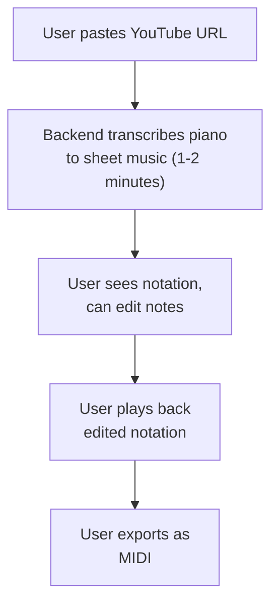

# MVP Scope & Implementation Roadmap

## MVP Definition (Phase 1)

**Goal**: Prove the core concept works end-to-end with a simple, focused feature set.

### Core User Flow

---

## MVP Features

### 1. Transcription
- ✅ YouTube URL input (validate and check availability)
- ✅ Audio download with yt-dlp
- ✅ Source separation with Demucs (4-stem)
- ✅ **Piano-only transcription** (other stem only, assume piano/keyboard)
- ✅ MIDI generation with basic metadata (key, tempo, time signature)
- ❌ Multi-instrument transcription (future)

**Limitation**: Assumes video has piano/keyboard in the mix. Works best for:
- Piano solo performances
- Piano covers
- Music with prominent piano/keyboard

---

### 2. Notation Display
- ✅ Render MIDI with VexFlow
- ✅ Single staff (treble clef)
- ✅ Basic note display (pitches, durations)
- ❌ Grand staff (treble + bass) - future
- ❌ Multi-part scores - future
- ❌ Articulations, dynamics - future

---

### 3. Editing
- ✅ Select notes (click)
- ✅ Delete notes (select + Delete key)
- ✅ Add notes (click on staff)
- ✅ Move notes (drag vertically to change pitch)
- ✅ Change duration (select + number key)
- ❌ Copy/paste - future
- ❌ Multi-select - future
- ❌ Undo/redo - nice-to-have for MVP, but optional

---

### 4. Playback
- ✅ Play/pause
- ✅ Tempo control (40-240 BPM)
- ✅ Basic piano synthesis (Tone.js sampler)
- ❌ Visual cursor sync - future
- ❌ Loop selection - future
- ❌ Metronome - future

---

### 5. Export
- ✅ Download MIDI
- ✅ Download MIDI
- ❌ PDF export - future (requires server-side rendering)

---

## Out of Scope for MVP

### Features Deferred to Phase 2+

- **Multi-instrument transcription**: Drums, bass, guitar, vocals
- **Instrument remapping**: Convert piano → violin, etc.
- **Advanced editing**: Copy/paste, multi-select, undo/redo
- **Grand staff**: Treble + bass clefs for piano
- **Articulations**: Staccato, accents, slurs
- **Dynamics**: p, f, mf, crescendo
- **Lyrics**: Text underlay
- **Collaboration**: Multiple users editing same score
- **Cloud storage**: Save/load scores from account
- **Authentication**: User accounts, login
- **PDF export**: Server-side rendering with MuseScore
- **Mobile app**: iOS/Android
- **Real-time collaboration**: Google Docs-style editing

---

## Success Criteria

### MVP is Successful If:

1. **Transcription works**: 70%+ accuracy on piano-only YouTube videos
2. **Editable output**: Users can fix transcription errors with basic edits
3. **Playback works**: Audio sounds recognizable, tempo control works
4. **Export works**: MIDI can be imported into DAWs

### MVP Fails If:

- Transcription accuracy < 50%
- Processing time > 5 minutes per song
- Frontend too slow/buggy for basic editing
- Exports don't open in notation software

---

## Implementation Phases

### Phase 1.1: Backend Pipeline (Week 1-2)

**Tasks**:
- [ ] Set up FastAPI project structure
- [ ] Implement YouTube download with yt-dlp
- [ ] Integrate Demucs for source separation
- [ ] Integrate basic-pitch for transcription
- [ ] MIDI parsing and rendering
- [ ] Test with 5-10 sample YouTube videos

**Deliverable**: Backend API that accepts URL, returns MIDI

---

### Phase 1.2: Async Workers (Week 2-3)

**Tasks**:
- [ ] Set up Redis + Celery
- [ ] Implement job queue and status tracking
- [ ] WebSocket for progress updates
- [ ] Error handling and retry logic
- [ ] Test with concurrent jobs

**Deliverable**: API + workers processing jobs asynchronously

---

### Phase 1.3: Frontend Basics (Week 3-4)

**Tasks**:
- [ ] React + Vite setup
- [ ] Job submission form (YouTube URL input)
- [ ] WebSocket connection for progress
- [ ] MIDI parser (@tonejs/midi)
- [ ] VexFlow rendering (simple, single staff)
- [ ] Basic UI/UX (progress bar, status messages)

**Deliverable**: Frontend that submits jobs and displays notation

---

### Phase 1.4: Editing (Week 4-5)

**Tasks**:
- [ ] Zustand store for notation state
- [ ] Click to select notes
- [ ] Delete notes (Delete key)
- [ ] Add notes (click on staff)
- [ ] Move notes (drag to change pitch)
- [ ] Change duration (number keys)

**Deliverable**: Interactive notation editor

---

### Phase 1.5: Playback & Export (Week 5-6)

**Tasks**:
- [ ] Tone.js integration
- [ ] Play/pause controls
- [ ] Tempo slider
- [ ] MIDI export (download)
- [ ] MIDI export (download)

**Deliverable**: Complete MVP with playback and export

---

### Phase 1.6: Polish & Testing (Week 6-7)

**Tasks**:
- [ ] UI polish (styling, responsive design)
- [ ] Error handling (user-friendly messages)
- [ ] Test with diverse YouTube videos
- [ ] Fix critical bugs
- [ ] Write README and setup docs

**Deliverable**: MVP ready for beta testing

---

## Testing Strategy

### Unit Tests

- Backend: Pipeline stages (download, separate, transcribe)
- Frontend: State mutations, note editing

### Integration Tests

- End-to-end: Submit URL → Receive MIDI → Render → Edit → Export

### Manual Testing

**Test Videos** (varied complexity):
1. Simple piano melody (Twinkle Twinkle)
2. Classical piano (Chopin Nocturne)
3. Pop song piano cover (Ed Sheeran)
4. Jazz piano (Bill Evans)
5. Fast passage (Flight of the Bumblebee)

**Metrics**:
- Transcription accuracy (% correct notes)
- Processing time
- UI responsiveness (editing lag)
- Export compatibility (MuseScore, Finale)

---

## Post-MVP Roadmap

### Phase 2: Multi-Instrument & Advanced Editing

- Transcribe all 4 stems (drums, bass, vocals, other)
- Multi-part score rendering
- Copy/paste, multi-select
- Undo/redo
- Grand staff for piano

### Phase 3: Polish & Scale

- PDF export
- Cloud storage (user accounts)
- Authentication
- Better UI/UX
- Mobile responsiveness
- Deploy to production

### Phase 4: Advanced Features

- Instrument remapping
- Collaboration
- Lyrics
- Dynamics, articulations
- Mobile app

---

## Next Steps

1. Review [Architecture Overview](../architecture/overview.md) for system design
2. Start with [Backend Pipeline](../backend/pipeline.md) implementation
3. Use [Deployment Strategy](../architecture/deployment.md) to set up local dev environment

See [Challenges](../research/challenges.md) for known limitations to design around.
