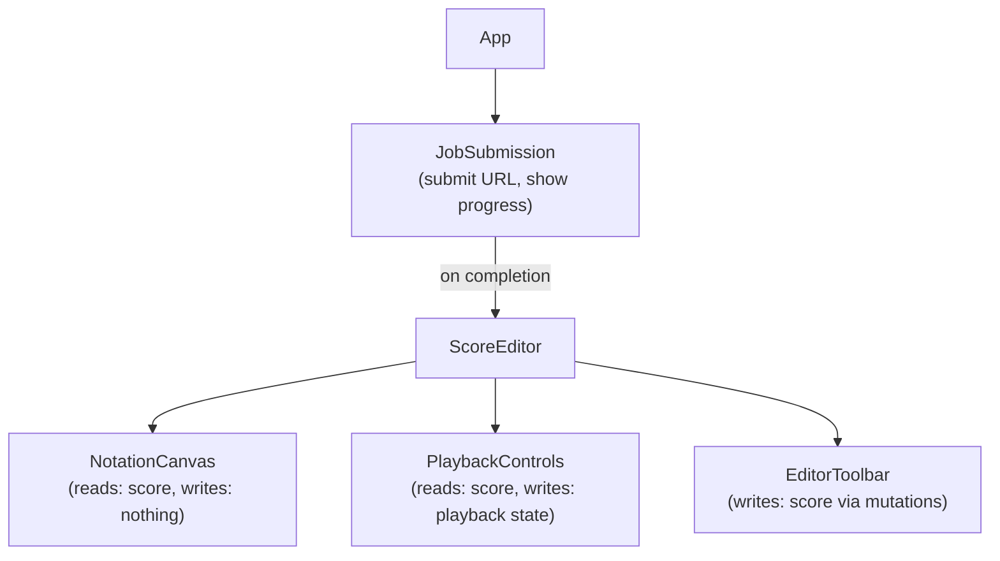

# Frontend Data Flow

## State Management Overview

The frontend manages three main data flows:
1. **Job Submission & Progress** - WebSocket updates from backend
2. **Notation Data** - MusicXML → Zustand → VexFlow rendering
3. **Editing Actions** - User input → State updates → Re-render

## Architecture

```
User Action
  ↓
React Component
  ↓
Zustand Store (mutations)
  ↓
VexFlow Re-render + Tone.js Playback
```

## Data Models

### API Layer

```typescript
// api/client.ts
export class RescoredAPI {
  private baseURL = 'http://localhost:8000/api/v1';

  async submitJob(youtubeURL: string): Promise<{ jobId: string }> {
    const response = await fetch(`${this.baseURL}/transcribe`, {
      method: 'POST',
      headers: { 'Content-Type': 'application/json' },
      body: JSON.stringify({ youtube_url: youtubeURL }),
    });

    return response.json();
  }

  async getScore(jobId: string): Promise<string> {
    const response = await fetch(`${this.baseURL}/scores/${jobId}`);
    return response.text();  // MusicXML string
  }

  connectWebSocket(jobId: string, onMessage: (msg: any) => void): WebSocket {
    const ws = new WebSocket(`ws://localhost:8000/api/v1/jobs/${jobId}/stream`);

    ws.onmessage = (event) => {
      const message = JSON.parse(event.data);
      onMessage(message);
    };

    return ws;
  }
}
```

### Job Submission Flow

```typescript
// hooks/useJobSubmission.ts
export function useJobSubmission() {
  const [jobId, setJobId] = useState<string | null>(null);
  const [progress, setProgress] = useState(0);
  const [status, setStatus] = useState<'idle' | 'processing' | 'completed' | 'failed'>('idle');

  const submit = async (url: string) => {
    const api = new RescoredAPI();
    const { jobId } = await api.submitJob(url);

    setJobId(jobId);
    setStatus('processing');

    // Connect WebSocket
    const ws = api.connectWebSocket(jobId, (message) => {
      if (message.type === 'progress') {
        setProgress(message.progress);
      } else if (message.type === 'completed') {
        setStatus('completed');
        loadScore(jobId);  // Fetch MusicXML
      } else if (message.type === 'error') {
        setStatus('failed');
      }
    });
  };

  const loadScore = async (jobId: string) => {
    const api = new RescoredAPI();
    const musicXML = await api.getScore(jobId);

    // Parse and load into notation store
    useNotationStore.getState().loadFromMusicXML(musicXML);
  };

  return { submit, jobId, progress, status };
}
```

### MusicXML Loading

```typescript
// store/notation.ts
interface NotationStore {
  score: Score;
  loadFromMusicXML: (xml: string) => void;
  exportToMusicXML: () => string;
}

export const useNotationStore = create<NotationStore>((set) => ({
  score: null,

  loadFromMusicXML: (xml) => {
    const parsed = parseMusicXML(xml);  // See notation-rendering.md

    set({
      score: {
        id: generateId(),
        title: parsed.title,
        measures: parsed.measures,
        key: parsed.key,
        timeSignature: parsed.timeSignature,
        tempo: parsed.tempo,
      },
    });
  },

  exportToMusicXML: () => {
    const { score } = get();
    return generateMusicXML(score);  // Reverse of parsing
  },
}));
```

## Component Data Flow



## Optimistic Updates

For better UX, update UI immediately before backend confirmation:

```typescript
const addNote = (note: Note) => {
  // Optimistically add to state
  set(state => ({
    score: {
      ...state.score,
      measures: addNoteToMeasure(state.score.measures, note),
    },
  }));

  // Save to backend (future: cloud sync)
  // If fails, revert
};
```

## Export Flow

```typescript
const handleExport = async (format: 'musicxml' | 'midi' | 'pdf') => {
  const { score } = useNotationStore.getState();

  if (format === 'musicxml') {
    const xml = exportToMusicXML(score);
    downloadFile(xml, 'score.musicxml');
  } else if (format === 'midi') {
    const midi = exportToMIDI(score);
    downloadFile(midi, 'score.mid');
  }
};
```

## Next Steps

See [WebSocket Protocol](../integration/websocket-protocol.md) for message details.
