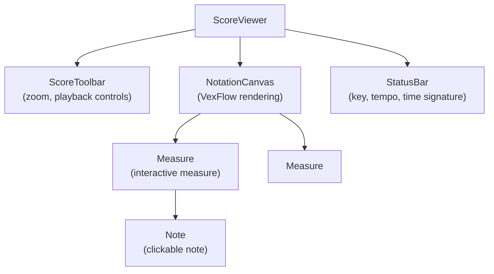

# Notation Rendering with VexFlow

## Overview

VexFlow is used to render MusicXML data as interactive SVG sheet music in the browser.

## Why VexFlow?

- **Pure JavaScript**: No dependencies, runs entirely in browser
- **High Quality**: Professional-grade music engraving
- **Programmatic API**: Build notation from code (good for editing)
- **SVG Output**: Vector graphics, sharp at any zoom level
- **Event Handling**: Can attach click handlers to notes/measures

## Architecture

```
MusicXML file
  ↓ (parse)
musicxml-interfaces / opensheetmusicdisplay parser
  ↓ (convert to VexFlow API calls)
VexFlow Renderer
  ↓ (generate)
SVG notation
  ↓ (attach)
Event listeners (click, drag for editing)
```

## Installation

```bash
npm install vexflow
```

## Basic VexFlow Rendering

### Minimal Example

```typescript
import { Renderer, Stave, StaveNote, Voice, Formatter } from 'vexflow';

function renderSimpleNotation(containerDiv: HTMLDivElement) {
  // Create renderer
  const renderer = new Renderer(containerDiv, Renderer.Backends.SVG);
  renderer.resize(500, 200);

  const context = renderer.getContext();

  // Create staff (one line of music)
  const stave = new Stave(10, 40, 400);
  stave.addClef('treble');
  stave.addTimeSignature('4/4');
  stave.setContext(context).draw();

  // Create notes
  const notes = [
    new StaveNote({ keys: ['c/4'], duration: 'q' }),  // Quarter note C4
    new StaveNote({ keys: ['d/4'], duration: 'q' }),  // Quarter note D4
    new StaveNote({ keys: ['e/4'], duration: 'q' }),  // Quarter note E4
    new StaveNote({ keys: ['f/4'], duration: 'q' }),  // Quarter note F4
  ];

  // Create voice and add notes
  const voice = new Voice({ num_beats: 4, beat_value: 4 });
  voice.addTickables(notes);

  // Format and draw
  new Formatter().joinVoices([voice]).format([voice], 400);
  voice.draw(context, stave);
}
```

**Output**: SVG rendering of 4 quarter notes on a treble staff.

---

## Parsing MusicXML

VexFlow doesn't have built-in MusicXML parsing, so we need a parser.

### Option 1: opensheetmusicdisplay (OSMD)

```bash
npm install opensheetmusicdisplay
```

```typescript
import { OpenSheetMusicDisplay } from 'opensheetmusicdisplay';

async function renderMusicXML(containerDiv: HTMLDivElement, musicXMLString: string) {
  const osmd = new OpenSheetMusicDisplay(containerDiv, {
    autoResize: true,
    backend: 'svg',
    drawTitle: false,
  });

  await osmd.load(musicXMLString);
  osmd.render();
}
```

**Pros**: Simple, handles MusicXML parsing
**Cons**: Uses OSMD's rendering (not VexFlow), harder to customize for editing

---

### Option 2: musicxml-interfaces + Custom Converter

```bash
npm install musicxml-interfaces
```

```typescript
import { parseScore } from 'musicxml-interfaces';
import { Stave, StaveNote, Voice } from 'vexflow';

interface NoteData {
  pitch: string;  // e.g., "c/4"
  duration: string;  // e.g., "q" for quarter
}

function parseMusicXMLToNotes(musicXML: string): NoteData[] {
  const score = parseScore(musicXML);

  const notes: NoteData[] = [];

  // Iterate through parts, measures, notes
  score.parts.forEach(part => {
    part.measures.forEach(measure => {
      measure.notes.forEach(noteElement => {
        const pitch = `${noteElement.pitch.step.toLowerCase()}/${noteElement.pitch.octave}`;
        const duration = mapDuration(noteElement.duration);

        notes.push({ pitch, duration });
      });
    });
  });

  return notes;
}

function mapDuration(durationValue: number): string {
  // MusicXML uses divisions (e.g., 480 per quarter note)
  // Map to VexFlow duration codes: "w" (whole), "h" (half), "q" (quarter), "8" (eighth)
  const divisions = 480;  // Standard value

  if (durationValue === divisions * 4) return 'w';
  if (durationValue === divisions * 2) return 'h';
  if (durationValue === divisions) return 'q';
  if (durationValue === divisions / 2) return '8';
  if (durationValue === divisions / 4) return '16';

  return 'q';  // Default
}

function renderNotesWithVexFlow(notes: NoteData[], containerDiv: HTMLDivElement) {
  const renderer = new Renderer(containerDiv, Renderer.Backends.SVG);
  const context = renderer.getContext();

  const staveNotes = notes.map(note =>
    new StaveNote({ keys: [note.pitch], duration: note.duration })
  );

  // ... create stave, voice, format, draw
}
```

**Pros**: Full control over VexFlow rendering
**Cons**: More work to parse MusicXML completely

---

## React Component Structure

### Component Hierarchy



### NotationCanvas Component

```typescript
import React, { useEffect, useRef } from 'react';
import { Renderer, Stave, StaveNote, Voice, Formatter } from 'vexflow';

interface NotationCanvasProps {
  musicXML: string;
  onNoteClick?: (noteId: string) => void;
}

export const NotationCanvas: React.FC<NotationCanvasProps> = ({ musicXML, onNoteClick }) => {
  const containerRef = useRef<HTMLDivElement>(null);
  const rendererRef = useRef<Renderer | null>(null);

  useEffect(() => {
    if (!containerRef.current) return;

    // Clear previous render
    containerRef.current.innerHTML = '';

    // Create renderer
    const renderer = new Renderer(containerRef.current, Renderer.Backends.SVG);
    renderer.resize(800, 600);
    rendererRef.current = renderer;

    const context = renderer.getContext();

    // Parse MusicXML and render
    const notes = parseMusicXMLToNotes(musicXML);
    renderStaves(notes, context);

    // Attach event listeners
    attachNoteEventListeners(containerRef.current, onNoteClick);

  }, [musicXML, onNoteClick]);

  return (
    <div
      ref={containerRef}
      className="notation-canvas"
      style={{ width: '100%', height: '600px', overflow: 'auto' }}
    />
  );
};

function attachNoteEventListeners(container: HTMLDivElement, onClick?: (noteId: string) => void) {
  // VexFlow renders notes as SVG <g> elements
  const noteElements = container.querySelectorAll('.vf-stavenote');

  noteElements.forEach((element, index) => {
    element.addEventListener('click', () => {
      if (onClick) {
        onClick(`note-${index}`);
      }

      // Highlight selected note
      element.classList.add('selected');
    });
  });
}
```

---

## Multi-Staff Rendering

For piano (treble + bass clefs):

```typescript
function renderPianoStaves(notes: { treble: NoteData[], bass: NoteData[] }, context) {
  // Treble staff
  const trebleStave = new Stave(10, 40, 400);
  trebleStave.addClef('treble');
  trebleStave.addTimeSignature('4/4');
  trebleStave.setContext(context).draw();

  const trebleNotes = notes.treble.map(n => new StaveNote({ keys: [n.pitch], duration: n.duration }));
  const trebleVoice = new Voice({ num_beats: 4, beat_value: 4 }).addTickables(trebleNotes);
  new Formatter().joinVoices([trebleVoice]).format([trebleVoice], 400);
  trebleVoice.draw(context, trebleStave);

  // Bass staff (connected with brace)
  const bassStave = new Stave(10, 140, 400);
  bassStave.addClef('bass');
  bassStave.setContext(context).draw();

  const bassNotes = notes.bass.map(n => new StaveNote({ keys: [n.pitch], duration: n.duration, clef: 'bass' }));
  const bassVoice = new Voice({ num_beats: 4, beat_value: 4 }).addTickables(bassNotes);
  new Formatter().joinVoices([bassVoice]).format([bassVoice], 400);
  bassVoice.draw(context, bassStave);

  // Draw brace connecting staves
  const brace = new StaveConnector(trebleStave, bassStave).setType('brace');
  brace.setContext(context).draw();
}
```

---

## Responsive Layout

### Auto-Resize on Window Resize

```typescript
useEffect(() => {
  function handleResize() {
    if (containerRef.current && rendererRef.current) {
      const width = containerRef.current.offsetWidth;
      rendererRef.current.resize(width, 600);

      // Re-render notation with new width
      reRenderNotation();
    }
  }

  window.addEventListener('resize', handleResize);
  return () => window.removeEventListener('resize', handleResize);
}, []);
```

---

## Styling & Theming

### CSS for Notation

```css
.notation-canvas {
  background: white;
  border: 1px solid #ccc;
  border-radius: 4px;
}

/* Highlight selected notes */
.vf-stavenote.selected {
  fill: #007bff;
  opacity: 0.7;
}

/* Hover effect */
.vf-stavenote:hover {
  cursor: pointer;
  opacity: 0.8;
}
```

---

## Performance Considerations

### Large Scores

- **Virtualization**: Only render visible measures (like react-window)
- **Pagination**: Show one page at a time, lazy-load other pages
- **Canvas vs SVG**: SVG is slower for 100+ measures, consider Canvas backend

```typescript
// Use Canvas backend for better performance
const renderer = new Renderer(container, Renderer.Backends.CANVAS);
```

### Measure-by-Measure Rendering

```typescript
function renderMeasure(measureData: MeasureData, yOffset: number) {
  const stave = new Stave(10, yOffset, 400);
  // ... render single measure
}

// Render only visible measures
const visibleMeasures = getVisibleMeasures(scrollPosition);
visibleMeasures.forEach((measure, index) => {
  renderMeasure(measure, index * 120);  // 120px per measure
});
```

---

## Accessibility

- **Keyboard Navigation**: Arrow keys to navigate notes
- **Screen Reader**: Add ARIA labels to SVG elements
- **Zoom**: Ctrl+/- to zoom in/out

```typescript
<div role="img" aria-label="Musical score in C major, 4/4 time">
  {/* VexFlow rendering */}
</div>
```

---

## Next Steps

1. Implement [Interactive Editor](editor.md) on top of rendered notation
2. Add [Playback System](playback.md) to sync audio with notation
3. Test with diverse MusicXML files (different keys, time signatures, multi-instrument)

See [Data Flow](data-flow.md) for state management of notation data.
