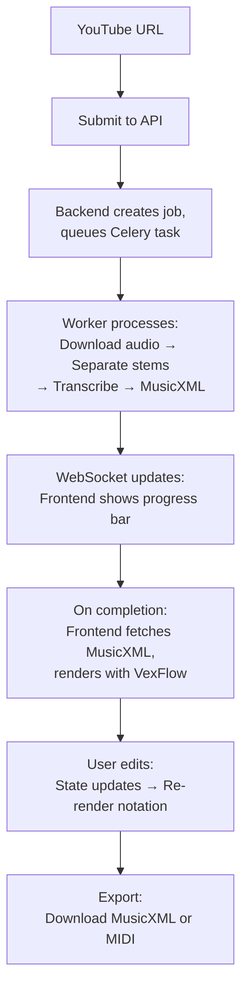

# Getting Started with Rescored Documentation

## Welcome

This documentation serves as the complete technical blueprint for building Rescored, an AI-powered music transcription and notation editor. Whether you're implementing the system, evaluating the architecture, or understanding design decisions, you'll find detailed information here.

---

## What is Rescored?

Rescored converts YouTube videos into editable sheet music:

1. User pastes YouTube URL
2. Backend downloads audio, separates instruments, transcribes to MIDI
3. MIDI converted to MusicXML (standard notation format)
4. Frontend renders notation, user can edit, play back, and export

**Target Users**: Musicians who want to learn songs, create arrangements, or transcribe performances.

---

## Documentation Philosophy

This documentation focuses on **high-level architecture and design decisions**, not implementation details like "how to install Python." It assumes:

- You're a developer comfortable with web development (React, Python/FastAPI, or both)
- You understand basic music concepts (notes, measures, clefs)
- You want to understand **why** choices were made, not just **what** to build

---

## How to Navigate This Documentation

### If You're New: Start Here

1. **Read the [README](README.md)** - Get an overview of doc structure
2. **[Architecture Overview](architecture/overview.md)** - Understand the system design
3. **[MVP Scope](features/mvp.md)** - See what to build first
4. **[Technology Stack](architecture/tech-stack.md)** - Understand tech choices

### By Role

#### Backend Engineer

**Your Mission**: Implement the audio processing pipeline (YouTube → MusicXML)

**Reading Order**:
1. [Architecture Overview](architecture/overview.md) - System context
2. [Audio Processing Pipeline](backend/pipeline.md) - Detailed workflow
3. [Background Workers](backend/workers.md) - Celery setup
4. [API Design](backend/api.md) - REST + WebSocket endpoints
5. [ML Model Selection](research/ml-models.md) - Demucs, YourMT3+, basic-pitch
6. [Challenges](research/challenges.md) - Known limitations

**Key Files to Create**:
- `backend/pipeline.py` - Main transcription logic
- `backend/tasks.py` - Celery workers
- `backend/api.py` - FastAPI endpoints
- `docker-compose.yml` - Local dev environment

---

#### Frontend Engineer

**Your Mission**: Build the notation editor and playback interface

**Reading Order**:
1. [Architecture Overview](architecture/overview.md) - System context
2. [Notation Rendering](frontend/notation-rendering.md) - VexFlow integration
3. [Interactive Editor](frontend/editor.md) - Editing operations
4. [Playback System](frontend/playback.md) - Tone.js audio
5. [Data Flow](frontend/data-flow.md) - State management
6. [WebSocket Protocol](integration/websocket-protocol.md) - Real-time updates

**Key Files to Create**:
- `frontend/src/components/NotationCanvas.tsx` - VexFlow rendering
- `frontend/src/components/PlaybackControls.tsx` - Audio playback
- `frontend/src/store/notation.ts` - Zustand store
- `frontend/src/api/client.ts` - API/WebSocket client

---

#### Full-Stack Engineer

**Your Mission**: Build end-to-end from URL to editable notation

**Reading Order**:
1. [Architecture Overview](architecture/overview.md)
2. [MVP Scope](features/mvp.md) - What to build first
3. [Deployment Strategy](architecture/deployment.md) - Local dev setup
4. Backend docs: [Pipeline](backend/pipeline.md), [API](backend/api.md), [Workers](backend/workers.md)
5. Frontend docs: [Rendering](frontend/notation-rendering.md), [Editor](frontend/editor.md), [Playback](frontend/playback.md)
6. Integration: [File Formats](integration/file-formats.md), [WebSocket](integration/websocket-protocol.md)

**Start Here**: Set up local environment with Docker Compose (see [Deployment](architecture/deployment.md))

---

#### Product/Design

**Your Mission**: Understand capabilities, limitations, and user flow

**Reading Order**:
1. [Architecture Overview](architecture/overview.md) - User flow diagram
2. [MVP Scope](features/mvp.md) - Phase 1 features
3. [Challenges](research/challenges.md) - Known limitations to design around
4. [ML Model Selection](research/ml-models.md) - Accuracy expectations

**Key Insights**:
- Transcription is ~80-85% accurate with YourMT3+, ~70% with basic-pitch fallback
- Users **must** edit output - editor is **critical**
- Processing takes 1-2 minutes (GPU) or 10-15 minutes (CPU)
- YourMT3+ optimized for Apple Silicon (MPS) with 14x speedup via float16
- MVP focuses on piano only, multi-instrument in Phase 2

---

## Key Concepts to Understand

### Music Notation Basics

If you're not familiar with music notation:
- **Staff**: 5 horizontal lines where notes are placed
- **Clef**: Symbol indicating pitch range (treble, bass)
- **Measure**: Group of beats separated by bar lines
- **Note Duration**: whole (4 beats), half (2 beats), quarter (1 beat), eighth (0.5 beats)

See [Glossary](glossary.md) for more terms.

---

### Tech Stack Overview

**Frontend**: React + VexFlow (notation) + Tone.js (playback)
**Backend**: Python/FastAPI + Celery (workers) + Redis (queue)
**ML**: Demucs (source separation) + YourMT3+ (primary transcription, 80-85% accuracy) + basic-pitch (fallback, 70% accuracy)
**Formats**: MusicXML (primary), MIDI (intermediate)

---

### Data Flow



---

## Setting Up Local Development

See the [main README](../README.md) for detailed setup instructions. Quick start:

```bash
# Clone repo
git clone https://github.com/yourusername/rescored.git
cd rescored

# Setup backend (Python 3.10)
cd backend
python3.10 -m venv .venv
source .venv/bin/activate
pip install -r requirements.txt

# Setup frontend
cd ../frontend
npm install

# Start all services (from project root)
cd ..
./start.sh

# Services:
# - Frontend: http://localhost:5173
# - Backend API: http://localhost:8000
# - API Docs: http://localhost:8000/docs
# - Redis: localhost:6379 (must be running: brew services start redis)

# Stop all services
./stop.sh
```

**Requirements:**
- Python 3.10 (for madmom compatibility)
- Node.js 18+
- Redis 7+
- FFmpeg
- YouTube cookies (see README for setup)

---

## Common Questions

### Q: Why separate docs instead of code comments?

**A**: Architecture and design decisions are best documented separately. Code comments explain "how," docs explain "why" and "what alternatives were considered."

### Q: Do I need to read everything?

**A**: No. Start with your role's reading path above, then dive deeper as needed.

### Q: What if I want to change a tech choice?

**A**: See [Technology Stack](architecture/tech-stack.md) for trade-offs. Each decision documents alternatives and why they weren't chosen.

### Q: How accurate is transcription?

**A**: 80-85% for simple piano with YourMT3+ (70-75% for complex music). Falls back to basic-pitch (70% simple, 60-70% complex) if YourMT3+ unavailable. See [ML Models](research/ml-models.md) and [Challenges](research/challenges.md).

### Q: Can I deploy this to production?

**A**: MVP is designed for local dev. See [Deployment Strategy](architecture/deployment.md) Phase 2 for production deployment (Vercel + Modal + Redis).

### Q: What's the MVP scope?

**A**: Piano-only transcription + basic editing + playback + export. See [MVP Scope](features/mvp.md).

---

## Next Steps

1. Choose your role's reading path above
2. Set up local dev environment (see [Deployment](architecture/deployment.md))
3. Start implementing! Backend pipeline or frontend rendering
4. Test with sample YouTube videos (piano performances)
5. Iterate based on accuracy and UX

---

## Contributing to Docs

As you implement Rescored, please update these docs with:
- Actual code examples (replace placeholders)
- Performance benchmarks (processing time, accuracy metrics)
- Lessons learned and gotchas
- Configuration details

**Keep it concise** - docs should be scannable, not novels.

---

## Need Help?

- **Check [Glossary](glossary.md)** for terminology
- **Review [Challenges](research/challenges.md)** for known issues
- **See [Tech Stack](architecture/tech-stack.md)** for decision context

Good luck building Rescored!
