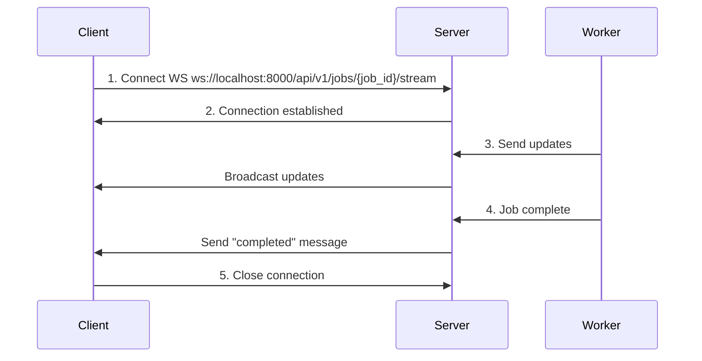

# WebSocket Protocol for Real-Time Updates

## Overview

WebSocket connections provide real-time progress updates from backend workers to the frontend during transcription.

## Why WebSocket?

- **Push-Based**: Server pushes updates, no client polling
- **Low Latency**: ~10-50ms vs. 1000ms for HTTP polling
- **Efficient**: Single persistent connection vs. repeated HTTP requests
- **Real-Time UX**: Smooth progress bar, stage updates

---

## Connection Lifecycle



---

## Message Types

### 1. Progress Update

**Sent by**: Worker during processing
**Frequency**: Every 5-10% progress or stage change

```json
{
  "type": "progress",
  "job_id": "550e8400-e29b-41d4-a716-446655440000",
  "progress": 45,
  "stage": "separation",
  "message": "Separated drums stem (2/4)",
  "timestamp": "2025-01-15T10:30:45Z"
}
```

**Fields**:
- `progress`: 0-100
- `stage`: "download" | "separation" | "transcription" | "musicxml"
- `message`: Human-readable status

---

### 2. Completion

**Sent by**: Worker when job finishes successfully

```json
{
  "type": "completed",
  "job_id": "550e8400-e29b-41d4-a716-446655440000",
  "progress": 100,
  "result_url": "/api/v1/scores/550e8400-e29b-41d4-a716-446655440000",
  "duration_seconds": 125,
  "timestamp": "2025-01-15T10:32:15Z"
}
```

**Client Action**: Fetch MusicXML from `result_url`

---

### 3. Error

**Sent by**: Worker when job fails

```json
{
  "type": "error",
  "job_id": "550e8400-e29b-41d4-a716-446655440000",
  "error": {
    "message": "GPU out of memory during source separation",
    "retryable": true,
    "stage": "separation"
  },
  "timestamp": "2025-01-15T10:31:00Z"
}
```

**Client Action**: Show error, optionally retry if `retryable: true`

---

### 4. Heartbeat (Keep-Alive)

**Sent by**: Server every 30 seconds
**Purpose**: Detect dropped connections

```json
{
  "type": "heartbeat",
  "timestamp": "2025-01-15T10:30:00Z"
}
```

**Client Action**: Send "pong" response

```json
{
  "type": "pong",
  "timestamp": "2025-01-15T10:30:00Z"
}
```

---

## Frontend Implementation

### WebSocket Hook

```typescript
import { useEffect, useState } from 'react';

interface ProgressUpdate {
  type: 'progress' | 'completed' | 'error';
  progress: number;
  stage?: string;
  message?: string;
  result_url?: string;
  error?: { message: string; retryable: boolean };
}

export function useJobProgress(jobId: string) {
  const [progress, setProgress] = useState(0);
  const [status, setStatus] = useState<'connecting' | 'processing' | 'completed' | 'failed'>('connecting');
  const [error, setError] = useState<string | null>(null);

  useEffect(() => {
    const ws = new WebSocket(`ws://localhost:8000/api/v1/jobs/${jobId}/stream`);

    ws.onopen = () => {
      console.log('WebSocket connected');
      setStatus('processing');
    };

    ws.onmessage = (event) => {
      const update: ProgressUpdate = JSON.parse(event.data);

      switch (update.type) {
        case 'progress':
          setProgress(update.progress);
          break;

        case 'completed':
          setProgress(100);
          setStatus('completed');
          // Fetch score
          fetchScore(update.result_url!);
          break;

        case 'error':
          setStatus('failed');
          setError(update.error!.message);
          break;

        case 'heartbeat':
          // Send pong
          ws.send(JSON.stringify({ type: 'pong', timestamp: new Date().toISOString() }));
          break;
      }
    };

    ws.onerror = (error) => {
      console.error('WebSocket error:', error);
      setStatus('failed');
      setError('Connection error');
    };

    ws.onclose = () => {
      console.log('WebSocket closed');
    };

    return () => {
      ws.close();
    };
  }, [jobId]);

  return { progress, status, error };
}
```

---

## Backend Implementation (FastAPI)

### Connection Manager

```python
from fastapi import WebSocket
from typing import Dict, List
import json

class ConnectionManager:
    def __init__(self):
        self.active_connections: Dict[str, List[WebSocket]] = {}

    async def connect(self, websocket: WebSocket, job_id: str):
        await websocket.accept()
        if job_id not in self.active_connections:
            self.active_connections[job_id] = []
        self.active_connections[job_id].append(websocket)

    def disconnect(self, websocket: WebSocket, job_id: str):
        if job_id in self.active_connections:
            self.active_connections[job_id].remove(websocket)

    async def broadcast(self, job_id: str, message: dict):
        """Send message to all clients connected to this job."""
        if job_id in self.active_connections:
            dead_connections = []

            for connection in self.active_connections[job_id]:
                try:
                    await connection.send_json(message)
                except:
                    dead_connections.append(connection)

            # Clean up dead connections
            for conn in dead_connections:
                self.disconnect(conn, job_id)

manager = ConnectionManager()
```

### WebSocket Endpoint

```python
@app.websocket("/api/v1/jobs/{job_id}/stream")
async def websocket_endpoint(websocket: WebSocket, job_id: str):
    await manager.connect(websocket, job_id)

    try:
        # Subscribe to Redis pub/sub for this job
        pubsub = redis_client.pubsub()
        pubsub.subscribe(f"job:{job_id}:updates")

        async for message in pubsub.listen():
            if message['type'] == 'message':
                update = json.loads(message['data'])
                await websocket.send_json(update)

                # Close connection if job completed or failed
                if update.get('type') in ['completed', 'error']:
                    break

    except WebSocketDisconnect:
        manager.disconnect(websocket, job_id)
    finally:
        pubsub.unsubscribe(f"job:{job_id}:updates")
```

---

## Error Handling

### Reconnection Strategy

```typescript
let reconnectAttempts = 0;
const MAX_RECONNECTS = 5;

function connectWithRetry(jobId: string) {
  const ws = new WebSocket(`ws://localhost:8000/api/v1/jobs/${jobId}/stream`);

  ws.onerror = () => {
    if (reconnectAttempts < MAX_RECONNECTS) {
      reconnectAttempts++;
      const delay = Math.min(1000 * 2 ** reconnectAttempts, 10000);  // Exponential backoff

      setTimeout(() => connectWithRetry(jobId), delay);
    } else {
      // Fallback to polling
      pollJobStatus(jobId);
    }
  };
}
```

### Fallback to Polling

If WebSocket fails, fall back to HTTP polling:

```typescript
function pollJobStatus(jobId: string) {
  const interval = setInterval(async () => {
    const response = await fetch(`/api/v1/jobs/${jobId}`);
    const job = await response.json();

    setProgress(job.progress);

    if (job.status === 'completed' || job.status === 'failed') {
      clearInterval(interval);
    }
  }, 2000);  // Poll every 2 seconds
}
```

---

## Security

### Authentication (Future)

```typescript
// Include JWT in connection
const ws = new WebSocket(`ws://localhost:8000/api/v1/jobs/${jobId}/stream?token=${jwtToken}`);
```

### Rate Limiting

Limit connections per IP to prevent abuse:

```python
from slowapi import Limiter

@app.websocket("/api/v1/jobs/{job_id}/stream")
@limiter.limit("10/minute")
async def websocket_endpoint(...):
    pass
```

---

## Next Steps

See [API Design](../backend/api.md) for REST endpoint integration.
